# LightBlog

基于 Express + TypeScript + MySQL 后端和 Vue 3 + TypeScript + Element Plus 前端的全栈博客系统，具备完整的用户系统、文章管理、社交互动和管理后台功能。

## ✨ 功能清单

### 前端用户端

| 功能         | 描述                                                     |
| ------------ | -------------------------------------------------------- |
| 🏠 首页      | 文章列表 + 侧边栏（热门文章/标签/分类）                  |
| 📝 文章      | 创建、编辑、删除、富文本编辑器（WangEditor）、封面图上传 |
| 💬 评论      | 发表评论、回复评论、评论树展示、删除                     |
| ❤️ 点赞/收藏 | 文章点赞、收藏、取消操作                                 |
| 👤 用户系统  | 注册、登录、个人主页、资料编辑、头像上传、密码修改       |
| 👥 关注系统  | 关注/取消关注、粉丝列表、关注列表                        |
| 🔔 通知系统  | 点赞/评论/回复/收藏/关注通知、全部已读、未读计数轮询     |
| 🔍 搜索      | 全文搜索文章                                             |
| 📂 分类/标签 | 分类浏览、标签浏览、热门分类/标签                        |
| 📱 响应式    | 移动端适配、汉堡菜单、侧边栏抽屉                         |

### 管理后台

| 功能        | 描述                                                 |
| ----------- | ---------------------------------------------------- |
| 📊 仪表盘   | 用户/文章/评论总数、今日新增、近7天趋势图（ECharts） |
| 👥 用户管理 | 用户列表、启用/禁用、重置密码                        |
| 📝 文章管理 | 文章列表、置顶、上下架、删除                         |
| 📂 分类管理 | 分类 CRUD                                            |
| 🏷️ 标签管理 | 标签 CRUD                                            |
| 🔒 权限控制 | 管理员中间件、JWT 认证                               |

## 🏛️ 技术架构

```text
前端 (Vue 3 + TypeScript + Element Plus)
  ├── composables/     (useArticle, useComments, useFollow, useFavorite...)
  ├── components/      (ArticleCard, Sidebar, CommentItem, UserInfoCard...)
  ├── views/           (Home, Detail, Write, Edit, Admin, User...)
  ├── stores/          (Pinia: user, notification)
  ├── api/             (axios 封装 + 拦截器)
  └── router/          (Vue Router + 路由守卫)
        │
        ▼ HTTP (REST API)
后端 (Express + TypeScript + MySQL)
  ├── controllers/     (auth, article, comment, like, follow, admin...)
  ├── services/        (业务逻辑层)
  ├── models/          (数据库操作层)
  ├── middlewares/      (auth, admin, optionalAuth)
  ├── routes/          (RESTful API 路由)
  ├── config/          (数据库连接、OSS 配置)
  └── utils/           (分页工具)
```

## 🚀 快速开始

### 环境要求

- Node.js ^20.19.0 || >=22.12.0
- MySQL 8.0+
- 阿里云 OSS（可选，用于图片上传）

### 1. 克隆项目

```bash
git clone <your-repo-url>
cd lightblog
```

### 2. 后端配置

```bash
cd server
npm install

# 配置环境变量
cp .env.example .env
# 编辑 .env，填入数据库和 OSS 配置：
# DB_HOST=localhost
# DB_USER=root
# DB_PASSWORD=your-password
# DB_NAME=lightblog
# JWT_SECRET=your-secret-key
# OSS_REGION=oss-cn-beijing
# OSS_ACCESS_KEY_ID=your-oss-access-key-id
# OSS_ACCESS_KEY_SECRET=your-oss-access-key-secret
# OSS_BUCKET=your-oss-bucket-name
```

### 3. 初始化数据库

**重要**：需要先执行数据库初始化脚本创建表结构：

```bash
# 方法1：直接执行 SQL 脚本（推荐）
mysql -u root -p < database/schema.sql

# 方法2：在 MySQL 命令行中执行
mysql -u root -p
# 进入 MySQL 后：
source database/schema.sql
```

**生成管理员密码**：

```bash
# 返回项目根目录
cd ..

# 生成 bcrypt 加密的密码（将 lejiawei1 替换为你想设置的密码）
node database/generate-password.js lejiawei1
```

**更新管理员密码**：

复制生成的哈希值，然后在 MySQL 中执行：

```sql
USE lightblog;

-- 更新管理员密码（将下面的哈希值替换为你生成的）
UPDATE users SET password = '$2b$10$你的真实哈希值' WHERE email = 'lanxiaole@admin.com';
UPDATE users SET password = '$2b$10$你的真实哈希值' WHERE email = 'weijiale@admin.com';
```

**默认管理员账号**：

| 邮箱                | 用户名    | 默认密码  |
| ------------------- | --------- | --------- |
| lanxiaole@admin.com | lanxiaole | lejiawei1 |
| weijiale@admin.com  | weijiale  | lejiawei1 |

### 4. 启动后端

```bash
cd server
npm run dev
# 运行在 http://localhost:3000
```

### 5. 前端配置

```bash
cd client
npm install
npm run dev
# 运行在 http://localhost:5173
```

## 📁 项目结构

```text
lightblog/
├── server/                       # 后端
│   ├── src/
│   │   ├── controllers/          # 控制器层
│   │   │   ├── admin/            # 管理后台控制器
│   │   │   ├── articleController.ts
│   │   │   ├── authController.ts
│   │   │   ├── commentController.ts
│   │   │   ├── favoriteController.ts
│   │   │   ├── followController.ts
│   │   │   ├── likeController.ts
│   │   │   ├── notificationController.ts
│   │   │   ├── ossController.ts
│   │   │   ├── searchController.ts
│   │   │   └── userController.ts
│   │   ├── services/             # 服务层（业务逻辑）
│   │   │   ├── admin/
│   │   │   ├── articleService.ts
│   │   │   ├── authService.ts
│   │   │   ├── commentService.ts
│   │   │   ├── favoriteService.ts
│   │   │   ├── followService.ts
│   │   │   ├── likeService.ts
│   │   │   ├── notificationService.ts
│   │   │   ├── ossService.ts
│   │   │   ├── searchService.ts
│   │   │   └── userService.ts
│   │   ├── models/               # 数据访问层
│   │   │   ├── article/
│   │   │   ├── Article.ts
│   │   │   ├── Category.ts
│   │   │   ├── Tag.ts
│   │   │   ├── User.ts
│   │   │   ├── Comment.ts
│   │   │   ├── Follow.ts
│   │   │   ├── Like.ts
│   │   │   ├── Favorite.ts
│   │   │   └── Notification.ts
│   │   ├── routes/               # 路由
│   │   ├── middlewares/          # 中间件（auth, admin, optionalAuth）
│   │   ├── config/               # 数据库连接、OSS 配置
│   │   ├── utils/                # 工具函数（分页）
│   │   ├── app.ts                # Express 应用
│   │   └── server.ts             # 启动入口
│   ├── package.json
│   └── tsconfig.json
├── client/                       # 前端
│   └── src/
│       ├── composables/          # 组合式函数（状态管理）
│       │   ├── article/
│       │   ├── comment/
│       │   ├── home/
│       │   └── user/
│       ├── components/           # 公共组件
│       │   ├── article/          # 文章卡片、编辑器、表单
│       │   ├── comment/          # 评论输入、评论项
│       │   ├── common/           # 侧边栏、加载/错误/空状态
│       │   └── user/             # 用户信息卡、头像上传、资料表单
│       ├── views/                # 页面视图
│       │   ├── home/             # 首页
│       │   ├── article/          # 文章详情、写文章、编辑文章
│       │   ├── auth/             # 登录、注册、管理员登录
│       │   ├── user/             # 个人主页、收藏、粉丝、关注
│       │   ├── admin/            # 管理后台（仪表盘、用户/文章/分类/标签管理）
│       │   ├── search/           # 搜索页
│       │   ├── notifications/    # 消息中心
│       │   ├── settings/         # 设置页
│       │   ├── category/         # 分类页
│       │   ├── tag/              # 标签页
│       │   ├── error/            # 404 错误页
│       │   └── layouts/          # 布局（默认布局、管理后台布局、用户布局）
│       ├── api/                  # API 调用层（axios + 拦截器）
│       ├── stores/               # Pinia 状态管理（user, notification）
│       ├── router/               # Vue Router + 路由守卫
│       ├── styles/               # 全局样式变量和混入
│       ├── App.vue
│       └── main.ts
├── database/                     # 数据库相关
│   ├── schema.sql                # 数据库表结构和初始化数据
│   ├── generate-password.js      # 密码加密工具
│   └── README.md                 # 数据库使用说明
├── README.md
└── package.json
```

## 🔧 核心功能详解

### 认证系统

- JWT 认证：用户登录后生成 JWT token，前端存储到 localStorage 或 sessionStorage（根据"记住密码"选项）
- 路由守卫：authMiddleware 验证 token，adminMiddleware 验证管理员权限，optionalAuthMiddleware 可选认证（登录后可获取点赞收藏状态）
- 密码加密：使用 bcryptjs 对密码进行哈希加密存储

### 文章系统

- 富文本编辑器：集成 WangEditor，支持图片上传到阿里云 OSS
- 封面图上传：Element Plus Upload 组件 + OSS 上传
- 分类/标签：文章可关联分类和多个标签，标签支持动态创建（getOrCreateTag）
- 文章内容以 HTML 格式存储和展示

### 社交互动

- 评论树：支持嵌套回复，平铺列表 → 树形结构计算
- 点赞/收藏：toggle 模式，同一用户重复操作不产生重复记录（数据库唯一约束 + 错误捕获）
- 关注系统：关注/取消关注，粉丝数和关注数实时更新
- 通知系统：
  - 点赞、评论、回复、收藏、关注五种通知类型
  - 前端每 10 秒轮询未读计数，Badge 显示在导航栏
  - 支持单条已读、全部已读、跳转到对应文章/用户

### 管理后台

- 仪表盘：ECharts 图表展示近 7 天用户增长和文章发布趋势
- 用户管理：列表搜索、启用/禁用账号、重置密码（生成随机密码）
- 文章管理：列表搜索、置顶/取消置顶、上下架、删除
- 分类/标签管理：CRUD 操作，删除前检查关联文章数量

### 热门算法

- 热门文章：热度 = 浏览量 × 1 + 点赞数 × 3 + 收藏数 × 5
- 热门分类/标签：热度 = 文章数 × 0.3 + 点赞数 × 0.3 + 收藏数 × 0.2 + 浏览数 × 0.2

### OSS 图片上传

- 支持头像、封面图、编辑器图片三个场景的上传
- 自动生成按日期分层的文件路径（images/20260501/uuid.jpg）
- 编辑器上传适配 WangEditor 的 errno: 0 响应格式

## 📦 依赖

### 后端

- express
- mysql2
- jsonwebtoken
- bcryptjs
- multer
- ali-oss
- cors
- dotenv
- typescript / ts-node
- nodemon

### 前端

- vue 3
- typescript
- element-plus
- pinia
- vue-router
- axios
- @wangeditor/editor
- @wangeditor/editor-for-vue
- echarts
- unplugin-auto-import
- unplugin-vue-components
- sass
- oxlint
- eslint
- prettier
- vite

##  项目截图演示

### 首页

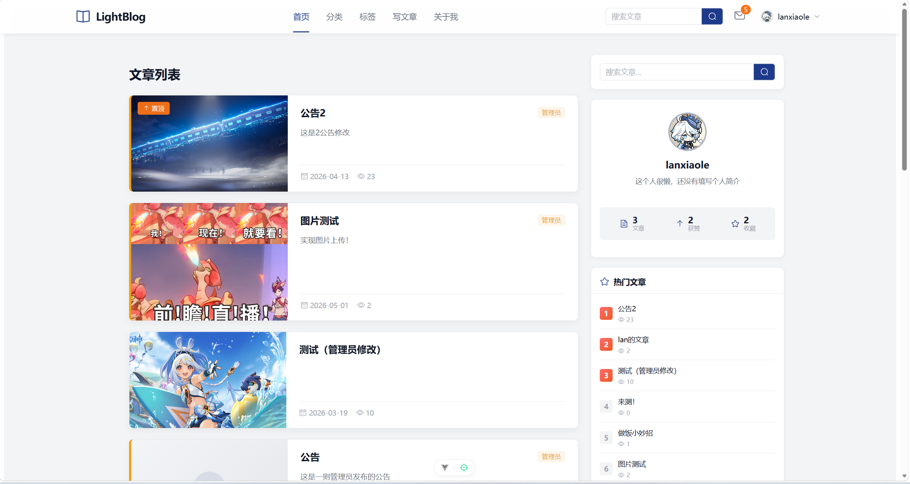

### 文章详情页

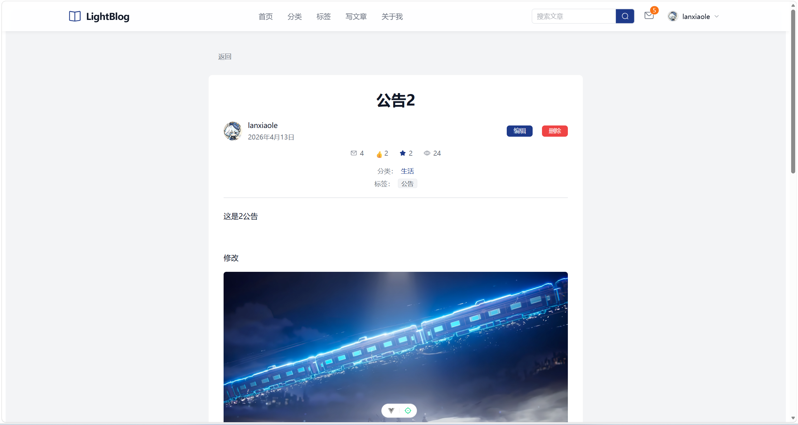

### 写文章页面

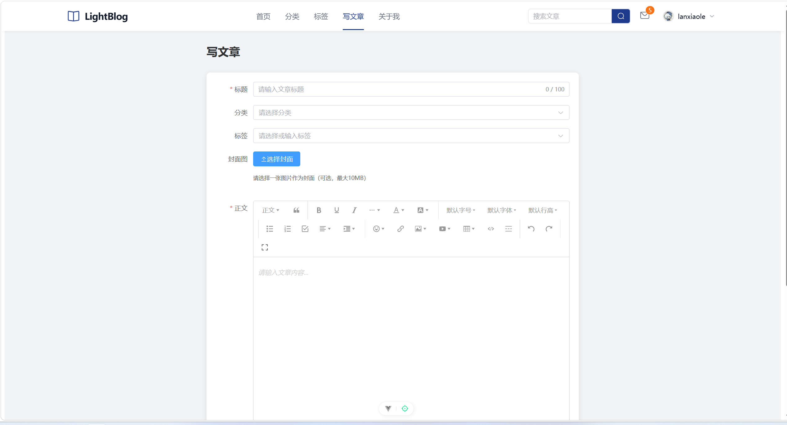

### 用户个人主页

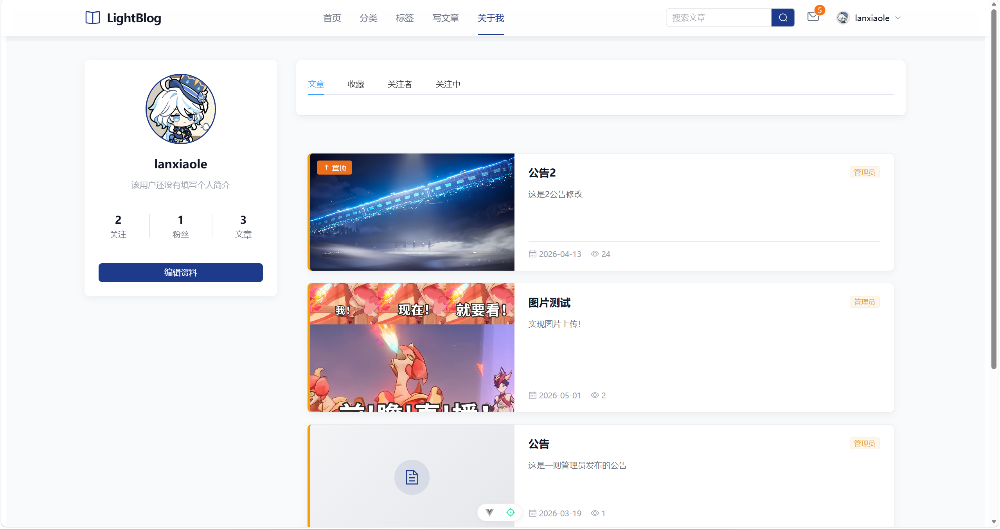

#### 个人收藏

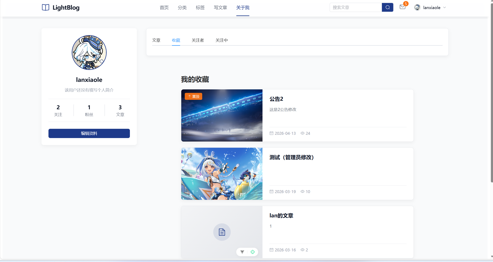

#### 个人粉丝

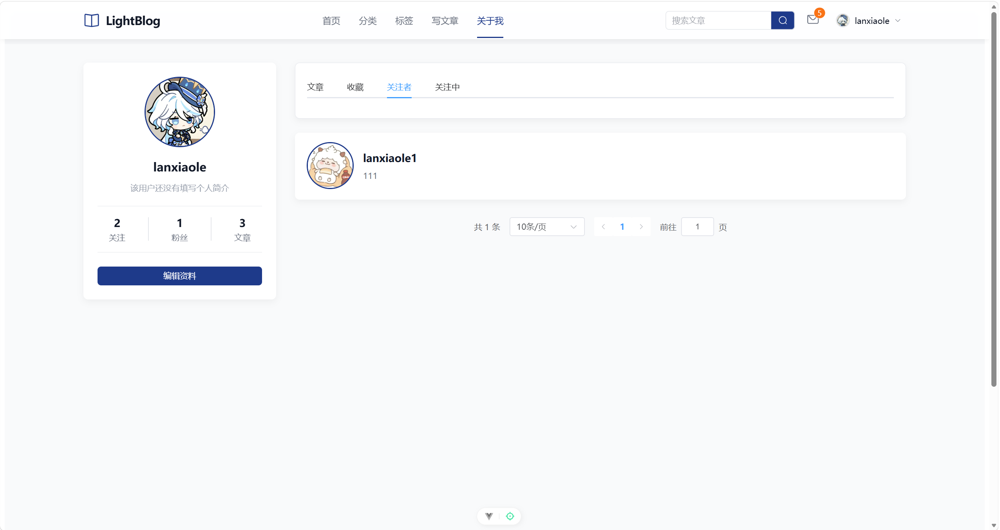

#### 个人关注

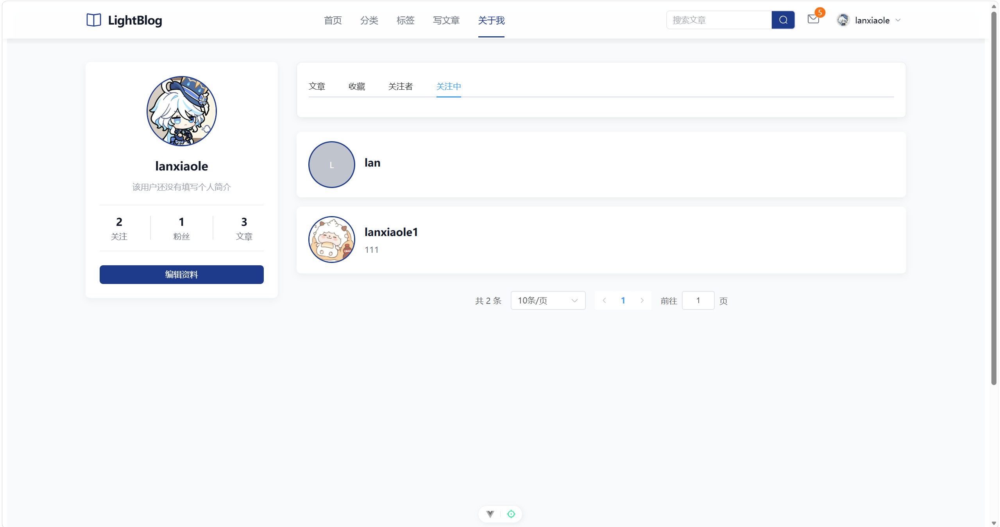

### 分类

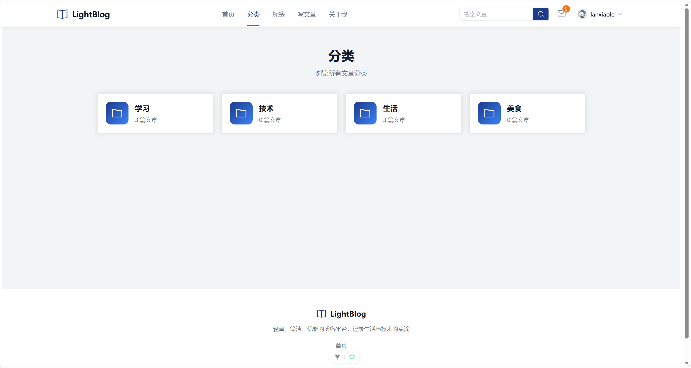

#### 分类列表

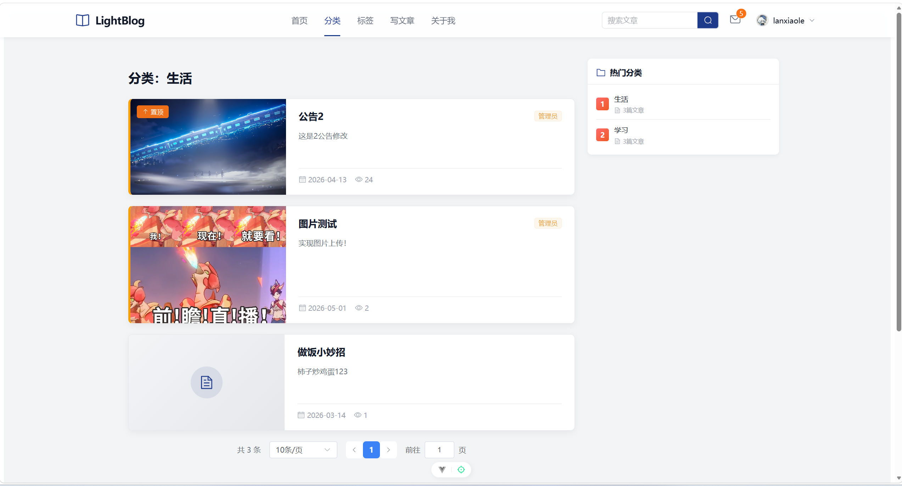

### 标签

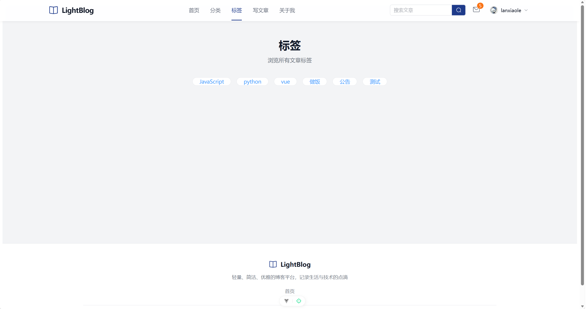

#### 标签列表

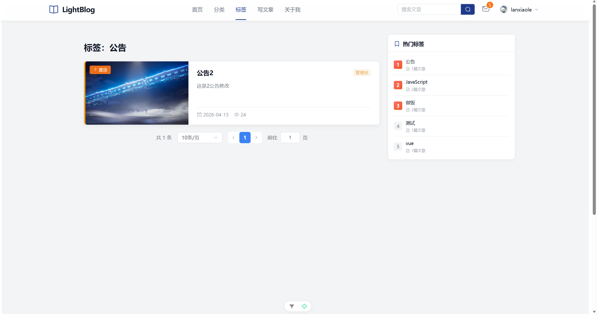


### 管理后台仪表盘

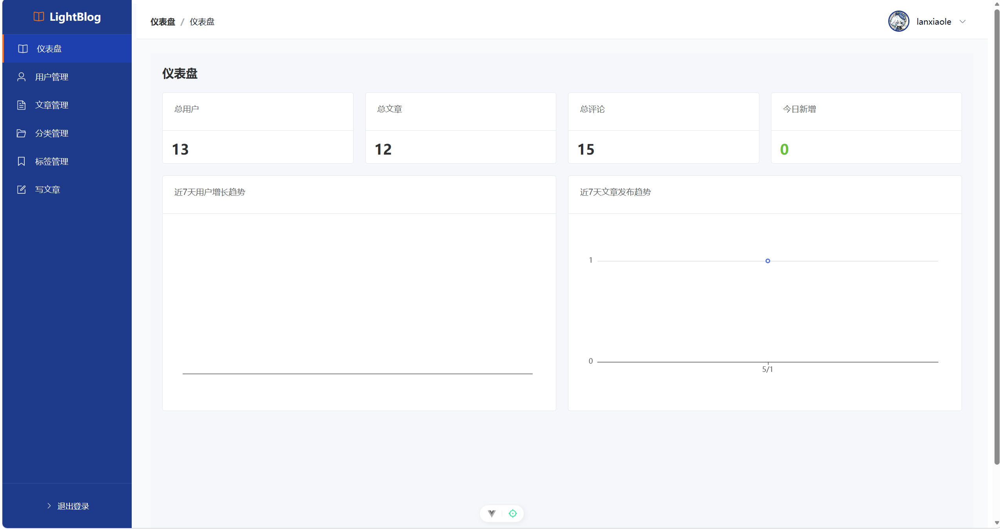

### 管理后台用户管理

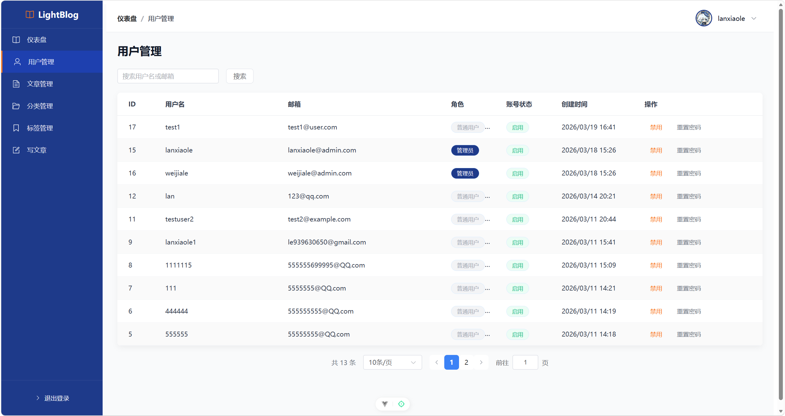

### 管理后台文章管理

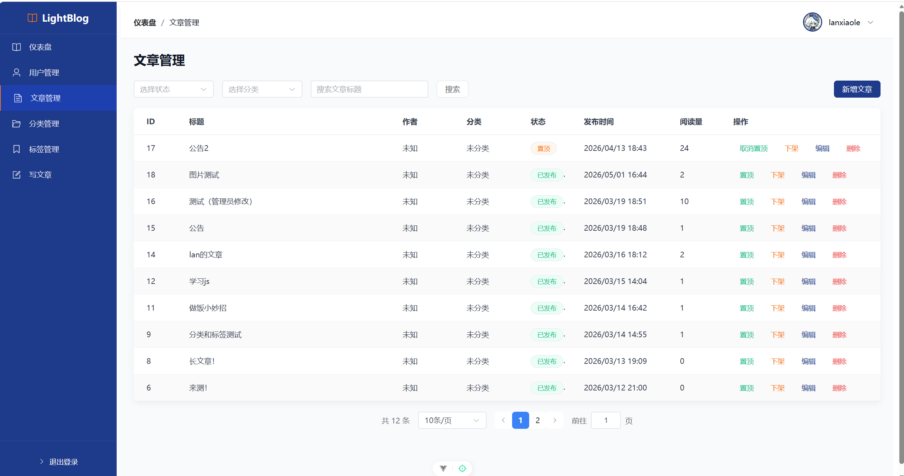

### 管理后台分类管理

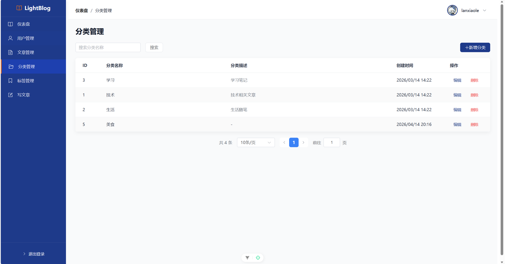

### 管理后台标签管理

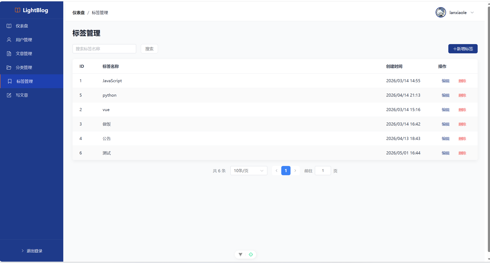

### 个人编辑资料

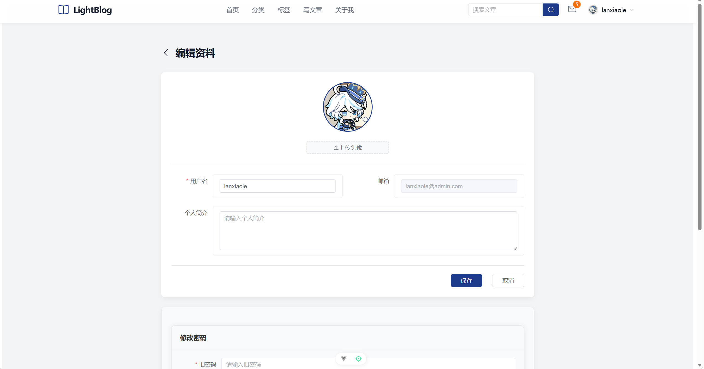

---

## 📚 API 文档

### 基础信息

- Base URL: `http://localhost:3000/api`
- 认证方式: Bearer Token (在请求头添加 `Authorization: Bearer {token}`)
- 数据格式: JSON

### 认证相关

| 方法 | 路径                | 描述             | 认证 |
| ---- | ------------------- | ---------------- | ---- |
| POST | `/auth/register`    | 用户注册         | 否   |
| POST | `/auth/login`       | 用户登录         | 否   |
| POST | `/auth/admin-login` | 管理员登录       | 否   |
| GET  | `/auth/me`          | 获取当前用户信息 | 是   |

### 文章相关

| 方法   | 路径                       | 描述             | 认证 |
| ------ | -------------------------- | ---------------- | ---- |
| GET    | `/articles`                | 获取文章列表     | 否   |
| GET    | `/articles/hot`            | 获取热门文章列表 | 否   |
| GET    | `/articles/category/:name` | 获取分类文章列表 | 否   |
| GET    | `/articles/tag/:name`      | 获取标签文章列表 | 否   |
| GET    | `/articles/:id`            | 获取文章详情     | 可选 |
| POST   | `/articles`                | 创建新文章       | 是   |
| PUT    | `/articles/:id`            | 更新文章         | 是   |
| DELETE | `/articles/:id`            | 删除文章         | 是   |
| POST   | `/articles/:id/views`      | 增加浏览量       | 否   |
| POST   | `/articles/:id/like`       | 点赞文章         | 是   |
| DELETE | `/articles/:id/like`       | 取消点赞         | 是   |

### 评论相关

| 方法   | 路径                            | 描述             | 认证 |
| ------ | ------------------------------- | ---------------- | ---- |
| GET    | `/articles/:articleId/comments` | 获取文章评论列表 | 否   |
| POST   | `/articles/:articleId/comments` | 发表评论         | 是   |
| DELETE | `/comments/:id`                 | 删除评论         | 是   |

### 分类相关

| 方法 | 路径              | 描述         | 认证 |
| ---- | ----------------- | ------------ | ---- |
| GET  | `/categories`     | 获取所有分类 | 否   |
| GET  | `/categories/hot` | 获取热门分类 | 否   |

### 标签相关

| 方法 | 路径        | 描述         | 认证 |
| ---- | ----------- | ------------ | ---- |
| GET  | `/tags`     | 获取所有标签 | 否   |
| GET  | `/tags/hot` | 获取热门标签 | 否   |

### 用户相关

| 方法 | 路径                        | 描述             | 认证 |
| ---- | --------------------------- | ---------------- | ---- |
| GET  | `/users/:username`          | 获取用户资料     | 否   |
| GET  | `/users/:username/articles` | 获取用户文章列表 | 否   |
| PUT  | `/users/profile`            | 更新用户资料     | 是   |
| PUT  | `/users/change-password`    | 修改密码         | 是   |

### 收藏相关

| 方法   | 路径                     | 描述         | 认证 |
| ------ | ------------------------ | ------------ | ---- |
| POST   | `/articles/:id/favorite` | 收藏文章     | 是   |
| DELETE | `/articles/:id/favorite` | 取消收藏     | 是   |
| GET    | `/users/me/favorites`    | 获取收藏列表 | 是   |

### 关注相关

| 方法   | 路径                           | 描述         | 认证 |
| ------ | ------------------------------ | ------------ | ---- |
| POST   | `/users/:userId/follow`        | 关注用户     | 是   |
| DELETE | `/users/:userId/follow`        | 取消关注     | 是   |
| GET    | `/users/:userId/followers`     | 获取粉丝列表 | 否   |
| GET    | `/users/:userId/following`     | 获取关注列表 | 否   |
| GET    | `/users/:userId/follow/status` | 获取关注状态 | 是   |

### 通知相关

| 方法 | 路径                          | 描述               | 认证 |
| ---- | ----------------------------- | ------------------ | ---- |
| GET  | `/notifications`              | 获取通知列表       | 是   |
| PUT  | `/notifications/:id/read`     | 标记通知为已读     | 是   |
| PUT  | `/notifications/read-all`     | 标记所有通知为已读 | 是   |
| GET  | `/notifications/unread-count` | 获取未读通知数量   | 是   |

### 搜索相关

| 方法 | 路径      | 描述         | 认证 |
| ---- | --------- | ------------ | ---- |
| GET  | `/search` | 全文搜索文章 | 否   |

### 文件上传相关

| 方法 | 路径          | 描述           | 认证 |
| ---- | ------------- | -------------- | ---- |
| POST | `/oss/upload` | 上传文件到 OSS | 是   |

### 管理后台相关

| 方法   | 路径                              | 描述         | 认证 | 管理员 |
| ------ | --------------------------------- | ------------ | ---- | ------ |
| GET    | `/admin/stats`                    | 获取统计数据 | 是   | 是     |
| GET    | `/admin/articles`                 | 获取文章列表 | 是   | 是     |
| PUT    | `/admin/articles/:id`             | 更新文章状态 | 是   | 是     |
| DELETE | `/admin/articles/:id`             | 删除文章     | 是   | 是     |
| GET    | `/admin/users`                    | 获取用户列表 | 是   | 是     |
| PUT    | `/admin/users/:id`                | 更新用户状态 | 是   | 是     |
| PUT    | `/admin/users/:id/reset-password` | 重置用户密码 | 是   | 是     |
| GET    | `/admin/categories`               | 获取分类列表 | 是   | 是     |
| POST   | `/admin/categories`               | 创建分类     | 是   | 是     |
| PUT    | `/admin/categories/:id`           | 更新分类     | 是   | 是     |
| DELETE | `/admin/categories/:id`           | 删除分类     | 是   | 是     |
| GET    | `/admin/tags`                     | 获取标签列表 | 是   | 是     |
| POST   | `/admin/tags`                     | 创建标签     | 是   | 是     |
| PUT    | `/admin/tags/:id`                 | 更新标签     | 是   | 是     |
| DELETE | `/admin/tags/:id`                 | 删除标签     | 是   | 是     |

---

## ❓ 常见问题 FAQ

### 数据库连接失败怎么办？

1. 确认 MySQL 服务已启动
2. 检查 `.env` 文件中的数据库配置是否正确
3. 确认数据库 `lightblog` 已创建
4. 确认用户有访问权限

### 管理员登录不上怎么办？

1. 确认已执行 `database/schema.sql` 初始化数据库
2. 确认已使用 `node database/generate-password.js` 生成并更新了密码
3. 确认访问 `/admin-login` 而不是 `/login`
4. 检查账号密码是否正确（默认账号见上面的数据库初始化部分）

### 图片上传不工作怎么办？

1. 确认已配置阿里云 OSS 相关环境变量
2. 检查 OSS AccessKey 是否有效
3. 确认 Bucket 名称正确
4. 检查网络连接是否正常
5. 如果没有 OSS，可以暂时只测试其他功能

### 如何重置管理员密码？

方法1: 使用密码生成工具

```bash
cd lightblog
node database/generate-password.js 你的新密码
# 复制生成的哈希值，然后在 MySQL 中执行
mysql -u root -p
USE lightblog;
UPDATE users SET password = '你的哈希值' WHERE email = 'lanxiaole@admin.com';
```

方法2: 注册一个新用户，然后手动在数据库中修改 `role` 为 `admin`

### 前端无法连接后端 API 怎么办？

1. 确认后端服务已启动在 `http://localhost:3000`
2. 检查前端的 API 配置（`client/src/api/index.ts` 中的 `baseURL`）
3. 检查浏览器控制台的网络请求
4. 确认没有被防火墙或杀毒软件拦截


### 如何查看完整的数据库初始化说明？

详细说明请查看 [database/README.md](database/README.md)

### 项目启动后没有自动创建表结构？

项目不会自动创建表结构，必须手动执行 `database/schema.sql` 来初始化数据库。

---

## 📝 许可证

MIT
